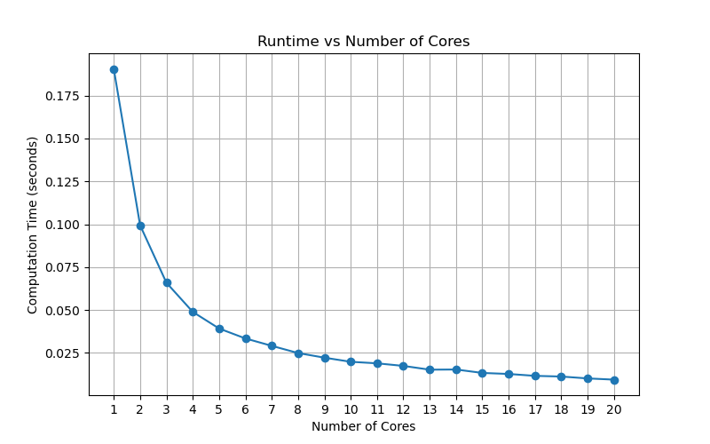
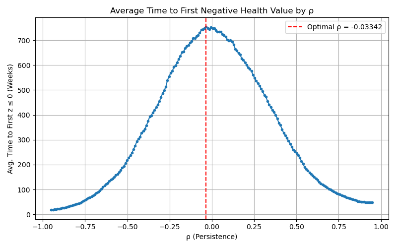

# MACS37123 Assignment 1

## Problem 1: Clocking CPU Parallelism
### Task 1(a): Numba Pre-Compilation
To improve performance, I moved the nested for-loop into a separate function and pre-compiled it using Numba’s `pycc`. I then benchmarked both the original serial code and the Numba-accelerated version on a single Midway CPU core.

**Results:**

- Serial execution time: 3.1207 seconds  
- Numba version time: 0.0337 seconds  
- **Speedup from Numba:** 92.68x

This speedup shows the effectiveness of ahead-of-time compilation using Numba's `pycc`, which removes the Python interpreter overhead and accelerates the computationally intensive loop.

### Task 1(b): Runtime vs. Number of Cores
In this task, I used MPI parallelism using `mpi4py`, distributing 1000 simulated lives evenly across 1 to 20 CPU cores. Each process generated its own share of random shocks using a seed based on its rank. I recorded the time taken for each run and plotted runtime against number of cores:



### Task 1(c) - Why Isn’t Speedup Linear?

As we can see from the plot, while the runtime decreases significantly as the number of cores increases, the speedup is not linear. Several factors contribute to this:

1. **Fixed Serial Overhead**: There's always some part of the code that cannot be parallelized, including initialization and final gathering.
2. **Communication Overhead**: As the number of processes increases, communication between cores (even minimal) becomes a larger portion of the total time.
3. **Diminishing Workload Per Core**: When splitting 1000 simulations across 20 cores, each core only runs 50 simulations — which may not fully utilize the core’s compute capacity due to under-parallelization.
4. **Startup Latency**: MPI initialization and task scheduling introduces latency, especially visible at lower runtimes.

Despite this, parallelism via MPI still provided excellent speedup and demonstrated scalable gains up to 20 cores.

## Problem 2： Grid Search for Optimal ρ

### Task 2(a): Parallelized Grid Search

To identify the optimal persistence value ρ that delays the first health failure (`z_t ≤ 0`), I performed a grid search over 200 values of ρ ranging from -0.95 to 0.95. Each ρ value was evaluated by simulating 1,000 health trajectories over 4,160 weeks and computing the average number of weeks until failure.

To parallelize the search:
- I used `Scatter` to divide the 200 ρ values evenly across 10 MPI ranks (20 per rank).
- A single matrix of random health shocks (`eps_mat`) was generated on rank 0 and distributed via `Broadcast`.
- Each rank computed average failure times for its subset of ρ values, and `Gather` was used to collect all results on rank 0.

**Total computation time:** `49.21 seconds` for running the whole thing. 

### Task 2(b): Plot of ρ vs. Avg. Time

The plot below shows how different ρ values affect the average number of periods before health fails. The curve peaks at a slightly negative ρ, suggesting mild mean-reversion improves resilience.




### Task 2(c): Best ρ and Interpretation

The **optimal ρ** found was:

```text
Best ρ: -0.03342
Average failure time: 754.25 weeks
```

## Problem 3: GPU NDVI Computation

### Task 3(a) and 3(b): GPU Implementation and Interpretation of the Results
In this task, I computed the NDVI using both a CPU-based NumPy and a GPU-accelerated version using PyOpenCL. To ensure numerical stability, I added a small epsilon to the denominator to avoid division by zero. The results are:

```text
CPU time: 0.0224 seconds  
GPU time: 0.0295 seconds  
```

Although GPU acceleration is generally faster for large-scale computations, in this case, the GPU version was slower potentially because:
1. The relatively small image size, making overhead costs (data transfer + kernel launch) dominate.
2. Highly optimized NumPy vectorized operations on CPU, which run very efficiently for elementwise math.

### Task 3(c): GPU performance relative to input size

To evaluate how GPU performance scales relative to CPU with different size, I simulated processing larger batches of Landsat scenes by tiling the original image using `np.tile()`. I tested four sizes: 20×, 50×, 100×, and 150×.

Each tiled image was processed using both the CPU (NumPy) and GPU (PyOpenCL) versions of NDVI, the runtime of each is:

**Results:**

| Scale Factor | Image Shape         | CPU Time (s) | GPU Time (s) |
|--------------|----------------------|--------------|--------------|
| 20×          | (1338, 42140)        | 0.4102       | 0.1998       |
| 50×          | (1338, 105350)       | 1.0291       | 0.4867       |
| 100×         | (1338, 210700)       | 2.0518       | 0.9773       |
| 150×         | (1338, 316050)       | 3.0887       | 1.6202       |


From the table, we can see that as input size increased, the GPU’s performance improved significantly:
- At small sizes, the CPU was initially competitive due to lower overhead.
- However, with the increase of input size, the GPU became faster, with increasing time difference with CPU-based implementations

These results confirm that **GPU acceleration becomes highly advantageous** for large raster datasets, where data-parallel workloads dominate and overhead splits quickly.

